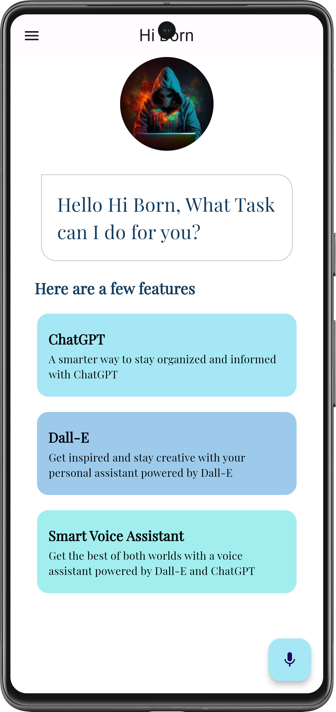

# Voice Assistant App with ChatGPT & DALL-E AI Image Generation

## Introduction

The Voice Assistant App with ChatGPT & DALL-E AI Image Generation is a cutting-edge Flutter application that combines the power of AI-driven voice interaction with creative image generation. This app allows users to communicate with their device naturally through voice commands, and it responds with ChatGPT for human-like text and DALL-E for generating images based on textual descriptions.

      <td style="padding-right: 20">
        
      </td>

## Features

- **Voice Interaction:** Communicate with your device naturally through voice commands.
- **Natural Language Processing:** Utilizes ChatGPT for understanding and generating human-like text responses.
- **AI Image Generation:** DALL-E integration for creating images based on textual descriptions.
- **User-Friendly Interface:** Designed with a user-friendly interface for a seamless experience.
- **Enhanced Productivity:** Simplify tasks, research, and creative projects with AI-driven responses and images.
- **Open-Source:** The app is open-source, encouraging collaboration and contributions from the community.

## Technologies Used

- Flutter
- ChatGPT (Natural Language Processing)
- DALL-E (AI Image Generation)
- Firebase (Backend Services)

## Installation

1. Clone this repository.
2. Navigate to the project folder.
3. Run `flutter pub get` to install dependencies.
4. Run `dart fix --apply` to install dependencies.
5. Ensure you have a Firebase project set up and add your configuration in the app.

## Usage

1. Build and run the Flutter app.
2. Use voice commands to interact with the assistant.
3. Enjoy natural language responses and image generation.
4. Contribute to the project or explore the code for AI integration in Flutter.

## Contributions

Contributions are welcome! If you'd like to improve this project or collaborate on new features, please follow these steps:

1. Fork the repository.
2. Create a new branch for your feature: `git checkout -b feature-yourfeature`
3. Commit your changes: `git commit -m 'Add some feature'`
4. Push to the branch: `git push origin feature-yourfeature`
5. Submit a pull request.

## License

This project is licensed under the MIT License. See the [LICENSE](LICENSE) file for details.

## Contact Me

Have questions or suggestions? Feel free to contact me at hiborn4@gmail.com
